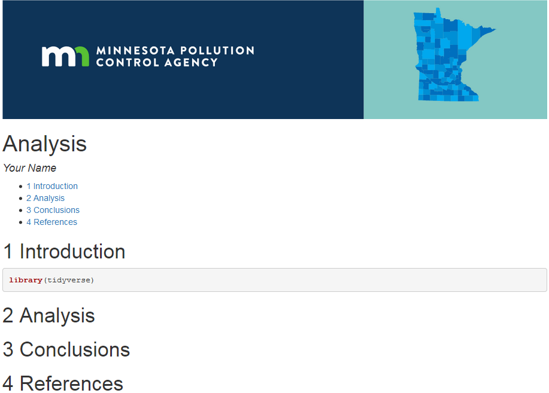

# `tidy( Tuesdays )`

 

Each week features a new data set to explore. Come see examples of how others clean, analyze, and visualize data. Learn new methods and share your own. Bring your burning questions, new packages, funny graphs, puzzles, and everything else you'd like to discuss about environmental data.  

:rocket: **Explore this week's [[ Data ]](https://github.com/rfordatascience/tidytuesday#datasets) and see what others are [[ Sharing ]](https://twitter.com/hashtag/TidyTuesday)**

  

## :coffee: The Morning warmup

> Try today's [Tuesday Team Quizzlet](https://forms.gle/YutRu6RfnVGJRo3y9)

 

Want to follow along? Jump to [RStudio Cloud](https://rstudio.cloud/) to use R in your browser.

 

## Schedule

### Up Next

|      | :tada:Show-n-tell | :coffee:Team Quizlet  | :candy: `sugaR pts`  | 
| ---  | --- | --- | --- |  
| Jan 12 |  [ggplot review](https://github.com/MPCA-data/tidytuesdays/blob/master/show-n-tell/exercises/Stars_and_galaxy_plot.MD) - Plotting with stars and [_patchwork_](https://patchwork.data-imaginist.com/) - Dorian | -- | 244 `pts` |

 

### Upcoming 
|      | Show-n-tell |  Team Quizlet  | :candy: `sugaR pts`  | 
| ---  | --- | --- | --- |  
| Jan 19 | Plan for Anniversary & Publication ready Plots & Tables - Barbara | -- | 244 `pts` |
| Jan 26 | :tada::tada::balloon:  1-Year ANNIVERSARY! :cake::tada::tada:   | -- | 444 `pts` |
| Feb 2 | Bootstrapping :boot: your 95% confidence intervals - Derek and Barbara| -- | 8 `pts` |
| Feb 9 | Plotly vs Leaflet Ultimate MashUp Barbara and Dorian | -- | 18 `pts` |
| Feb 16 | R and R Studio Tips and Tricks/Best Practices | -- | 38 `pts` |
| Feb 23 | Make your first RMarkdown Dorian | -- | 28 `pts` |
| Mar 2 | the sf package - st_distance, st_buffers and st_intersection OH MY! Kristie | -- | 48 `pts` |
| Mar 9 | My First R Script. Data Structures. What can I do with this .R file? | -- | 68 `pts` |
| Mar 16 | Attempts and Foibles at machine learning in R Barbara and Kristie | -- | 58 `pts` |
| Mar 23 | Pipes, dots and other magrittr operators 'That dot that Derek uses' | -- | 78 `pts` |
| Mar 30 | Searching for emails - Derek | -- | 100 `pts` |
| Apr 6 | Journal articles in R Kristie | -- | 14 `pts` |
| Apr 13 | Cat Detectives with dplyr Kristie and Dorian and Derek :cake: | -- | 14 `pts` |
| Apr 20 | sqlite databases in R Barbara | -- | 14 `pts` |

 

### Past
|      | Show-n-tell | Team Quizlet  | :candy:`sugaR pts`  | 
| ---  | --- | --- | --- |  
| Jan 05 | R Resolutions: Learning goals for 2021 - Kristie & [Send E-mails with R](https://github.com/MPCA-data/tidytuesdays/blob/master/show-n-tell/emails/R%20send%20email.R) - Derek | -- | 144 `pts` |  
| Dec 15 | [Survey Analysis w/ MPCA's Travel survery](https://github.com/MPCA-data/tidytuesdays/blob/master/show-n-tell/survey_data/commuter_survey_analysis.R) - Laura & Derek | -- | 650 `pts` |
| Dec 08 | :art::earth_africa: [Group Exercise: ARTsy Maps](https://github.com/MPCA-data/tidytuesdays/blob/master/show-n-tell/maps/art_map_poster.md#map-art) - Dorian  | -- | 14 `pts` |
| Dec 01 | Fabulous day of errors, mistakes, and Gotcha's - Kristie | -- | 42 `pts` |
| Nov 17 | [More Dates & Times - A Loon Survery](https://github.com/MPCA-data/tidytuesdays/blob/master/show-n-tell/dates/Loon_survey_DATES_exercise.md#loon-survey-2021) | [Dates](https://forms.gle/YutRu6RfnVGJRo3y9) _(quizzlet)_  | 1.1 `pts` |
| Nov 10 | Day of Dates and Timezones - Dorian | [Dates](https://forms.gle/YutRu6RfnVGJRo3y9)  | 1.1 `pts` |
| Nov 3 | [Regular expressions `regex` 101](https://github.com/MPCA-data/tidytuesdays/blob/master/show-n-tell/strings/stringr_regex_tutorial.md) - Derek | [Strings & things](https://forms.gle/bDVjCnwwcQZQB92H8)  | +novemdecillion `pts` |
| Oct 27 | :ghost: [Halloween exercise](https://github.com/MPCA-data/tidytuesdays/blob/master/show-n-tell/exercises/Hallows_Eve.MD#2020--trick-or-treat): Text mining candy / scary movie data  | Everyone | +1031 `pts`|
| Oct 20 | Time series forecasting :chart_with_downwards_trend:  | Barbara | +2050 `pts`|
| Oct 13 | Group exercise: TidyTuesday data dive [Warmup with Porgs](https://itep-r.netlify.app/page/day2_am.html#porg-review).    Data at `read_csv("https://itep-r.netlify.com/data/porg_data.csv")`  | Everyone | +1000 `pts`|
| Oct 6 | Questions and Andrea's Shiny tool | Andrea | +2000 `pts` |   
| Sep 29 |  [Group exercise fun: Data Validation](https://github.com/MPCA-data/tidytuesdays/tree/master/show-n-tell/tiny_giraffes_data_validation) | Kristie | 1024 `pts`|
| Sep 22 | [USGS R community](https://owi.usgs.gov/R/) & packages** (Emily B. and Aida and Dorian) | | +2000 `pts`|
| Sep 15| Group [`swirl`](https://github.com/swirldev/swirl_courses#install-and-run-a-course-automatically-from-swirl) `Back to Basics` :: [Quick Start](https://github.com/MPCA-data/tidytuesdays/blob/master/show-n-tell/exercises/swirl.MD#swirl-setup) | Barbara | +300 `pts`|
| Sep 08 | Q: How to join by date range or fuzzy join or non-equal join? A: Use [`unnest()`](https://github.com/MPCA-data/tidytuesdays/blob/master/help/puzzles/join_range_of_dates.R) or [`library(data.table)`](https://github.com/MPCA-data/tidytuesdays/blob/master/help/puzzles/non_equal_join_example.R)  |  | +55 `pts` |
| Sep 01 | Landuse analysis w/ the raster package (Kristie) | | +140 `pts` |  
| Aug 25 | Finish for() loops, and apply() functions | | +120 `pts` |
| Aug 18 | for() loop alternatives: apply() functions & looping w/ purrr (Derek)| | +1500 `pts` |
| Aug 11 | Non-parametric stats with water Sulfate data | | +1000 `pts`|
| Aug 04 |  R Markdown [`mpcareports`](https://github.com/MPCA-data/mpcareports/blob/master/README.md#mpcareports) templates & easier databases: [`mpcadb`](https://github.com/MPCA-data/mpcadb#mpcadb) (Dorian)** | | +50 `pts`|
| Jul 28 |  (Barbara improvises) | |  +200 `pts` * |
| Jul 21 | [Get data from TEMPO or OnBase and score the similarity of names](https://github.com/MPCA-data/tidytuesdays/blob/master/show-n-tell/strings/tidytuesday_stringdist.R): [`stringdist()`](https://github.com/markvanderloo/stringdist)  (Derek)  | | +1264 `pts`|
| Jul 14 | Introduction to Biological Monitoring program (Joel C) | Bugs! :beetle: Generalized Linear Models (Carl S)| +300 `pts` | 
| Jun 23 | [Checking for differences](https://github.com/MPCA-data/tidytuesdays/blob/master/show-n-tell/reading_files/Waldo_Compare_files_Find_differences.Md) w/ the `waldo` pkg: [`compare()`](https://github.com/r-lib/waldo#installation) _(Dorian)_| [Pear programming puzzles](https://github.com/MPCA-data/tidytuesdays/blob/master/show-n-tell/exercises/pair_programming.md) _(everyone)_ |  +100 `pts` |  

 

 <b> Older topics </b>

  
| Date | R demo   _1st half_  | Show-n-tell   **:tada:**   _2nd half_ | :candy: Bonus   `sugaR pts`  |   
| ---  | --- | --- | --- |  
| Jun 16 | [MDH shares: Grouping data frames in a list & date intervals](https://github.com/MPCA-data/tidytuesdays/blob/master/help/insurance_data/function_list_to_df.md) _(Jennifer)_ | Mapping HUGE Raster layers _(Min)_ |  +100 `pts` |   
| Jun 09 | Barbara connects to GIS Rest API services - You can too! | |  +100 `pts` | 
| Jun 02 | Zipping, factors, date joins and more Kristie tips _(Kristie)_ |  |   | 
| May 26 | T-tests and the `carr` pkg; Nonparametric or parametric? _(Barbara)_ |  |   | 
| May 19 | [More mapping tools in R: With MPCA's Environmental Justice maps](https://github.com/MPCA-data/tidytuesdays/blob/master/show-n-tell/maps/find_hospitals.R) _(Dorian)_| |   | 
| May 12 | Shiny tools & [widgets](https://shiny.rstudio.com/gallery/widget-gallery.html) _(Barbara_ & _Derek)_; Schedule your R scripts: Daily, Weekly, Monthly _(Barbara)_ | Use [`fill()`](https://tidyr.tidyverse.org/reference/fill.html) to fill gaps in names w/ previous value _(Kristie)_ |  +100 `pts` | 
| May 05 | Custom colors and palettes _(Barbara)_ | Allison on sulfate outliers  |   +100 `pts` | 
| Apr 28 | [Create a package :package:](https://github.com/MPCA-data/tidytuesdays/tree/master/show-n-tell/make_package#package-take-home-your-very-own-package) _(Dorian)_ | +You? Me? Everyone? |   +100 `pts` |   
| Apr 21 | [Princ. Comp. Analysis and multi-variate predictions](https://github.com/MPCA-data/tidytuesdays/tree/master/show-n-tell/multivariate) _(Kristie)_ | Matt on toxic algae |   +100 `pts` | 
| Apr 14 | [Get 100's of PDFs from TEMPO and read their messy data into R](https://github.com/MPCA-data/tidytuesdays/blob/master/show-n-tell/tempo/Tidy%20Tuesday%20Tempo%20Demo.R) _(Derek)_ |  |   +50 `pts` |  
|  | :earth_asia: [Create & read shapefiles](https://github.com/MPCA-data/tidytuesdays/tree/master/show-n-tell/make_book) _(Kristie)_ |  |   |  
|  | :book: [Make website books w/ Rmarkdown: `bookdown`](https://github.com/MPCA-data/tidytuesdays/tree/master/show-n-tell/make_book) _(Dorian)_ |  |   |  
|  | [Summaries of Non-detect data: `EnvStats` & `NADA`](https://github.com/MPCA-data/tidytuesdays/tree/master/show-n-tell/non-detects) _(Derek + Barbara)_ |  |  |  
|  | [Build your own package: `devtools`](https://github.com/MPCA-data/tidytuesdays/tree/master/show-n-tell/make_package#package-take-home-your-very-own-package) _(Dorian)_ |  |   |  
|  | [Multivariate Analysis](https://github.com/MPCA-data/tidytuesdays/blob/master/show-n-tell/multivariate/multivariate.md) _(Kristie)_ |  |   |  
|  | Microsoft Access data. Arrrrgghh... _(Barbara)_ | |   |   
|  | Time series forecasting, with total garbage data _(Barbara)_ |  |  |  

 

## Events & Recordings _(around the world)_

| Date | Time | Event  | Event link | Group webpage |  
| ---  | --- | --- | --- | --- |
| Jul 07-17 | Recordings | useR! 2020: Intl. R user conference | [useR 2020](https://user2020.r-project.org/program/agenda/)|  |
| Jul 14-15 | 9:00-1pm | MN's R North Conference| [noRth 2020](https://rnorthconference.github.io/#about)|  |
| May 14 | 6:30-8pm | Multi-level Modeilng : Twin Cities RLadies| [Online Meetup](https://www.meetup.com/rladies-tc/events/268384963/?rv=ea1_v2&_xtd=gatlbWFpbF9jbGlja9oAJGQ5NTI4ZDA3LTcxYjctNDY4MS04NWEzLWFkZDZkZmZjZWI3OA)| [TC R Ladies](https://www.meetup.com/rladies-tc) |
| Apr 7, 9, 16, 23 | 1-2:30 | Intro to R workshops : MARAMA | Recordings: [Intro to R](https://register.gotowebinar.com/recording/979473951571635467); [tidyverse](https://register.gotowebinar.com/recording/3300678235076032514); [ggplot](https://register.gotowebinar.com/register/2580834570751859715) |  [MARAMA training](https://marama.org/events/introduction-to-r-training-webinar-2020/) |   
| March 24, 2020 | 2:30pm | Plot anything w/ ggplot - Online workshop | [ggplot workshop](https://www.youtube.com/watch?v=h29g21z0a68&feature=youtu.be) |  | 
| Jan 29, 2020 | 10-4  |  RStudio Conf 2020 - Recordings available | [RStudio 2020](https://resources.rstudio.com/rstudio-conf-2020)  |   https://resources.rstudio.com   |

 

## :phone: Calls for **collaboration**
Let's team up on this.

- [ ]  None at this time. Stay tuned.

 

## :hatching_chick: What we're learning

  

- [Cute giraffe stats](https://tinystats.github.io/teacups-giraffes-and-statistics/01_introToR.html)
- [Coursera courses](https://www.coursera.org/specializations/jhu-data-science#courses)
- [Intro to modeling & predictions](https://supervised-ml-course.netlify.com/chapter1)
- [Mixed model tutorial](https://ourcodingclub.github.io/tutorials/mixed-models/)
- [lme4 package vignette](https://cran.r-project.org/web/packages/lme4/vignettes/lmer.pdf) 

   

## :book: Readings

- Hadley's [R 4 Data Science](https://r4ds.had.co.nz/)
- Helsel's books at [Practical Stats](http://www.practicalstats.com/info2use/books.html)

 

## :earth_africa::busts_in_silhouette: Community projects

> Open to all to contribute – especially you!

 

| Project | Details | Team contact |  | Wishlist  |  
| ---  | --- | --- | --- | --- | 
| [`library(mpcaej)`](https://github.com/MPCA-data/mpcaej#mpcaej) | Shapefiles with MPCA’s criteria for areas of concern for environmental justice | Dorian | | |
| [`library(mncolors)`](https://github.com/MPCA-data/mncolors#minnesota-color-palettes) | Paint your data with colors from the [MN State Brand style Guide](https://mn.gov/portal/brand/style-guide/colors/), plus a few palettes inspired by local landscapes and wildlife. | Dorian | | |
| [`library(mpcadb)`](https://github.com/MPCA-data/mpcadb) | Easy R connections to MPCA’s databases: DELTA, TEMPO, EQUIS, RAPIDS, ONBASE...    - Store common reference data | Derek | | |
| [`library(mpcareports)`](https://github.com/MPCA-data/mpcareports#mpcareports) | MPCA themes for markdown reports -Templates with logo, header, fonts   | Dorian | | | 
|[MPCA Data Guide](https://mpca-data.github.io/Data-Guide/) | A guide to data locations and instructions for water, land, air, and more | | | Add data publishing/sharing tips  |
| [Analysis Methods Guide](https://mpca-air.github.io/air-methods/) | How we analyze monitoring data in R _(currently air focused)_ | | | | 
| R training | - [Star Wars training](https://itep-r.netlify.com/)    - [Workshops](https://mpca-air.github.io/RTrain/#workshops) (Maps, Connecting to databases, messy data)    - [Cat training](https://mpca-air.github.io/RCamp/) (the original)  | | | | 

 

## Future topics

> 1. Read / send Outlook emails & attachments with `R` _(Derek & Barbara)_
> 1. Automate report updating on a R server?
> 1. Download tables of data from websites _(Sarah)_
> 1. Loops: `purrr` package or `for()` loops or `lapply()`?
> 1. Find data in TEMPO database _(Aida)_
     - Push data into TEMPO ??? Is this possible?
> 1. Combine, clean and read output from environmental models such as AERMOD
> 1. Compare large modeling files submitted by consultants: k-diff or `waldo` package
> 1. Intro to Rmarkdown
>     - Create a manual for training or methods recording
> 1. Make website for training _(Min)_
> 1. Maps and shapefiles
>     - Kriging / Spatial interpolating between map points
> 1. Is it an outlier?
> 1. Conditional probability
> 1. Python & R: `reticulate`
> 1. Show-n-tell something you want to replace: An Excel tool, Word/PDF report, Access database, 
> 1. `gganimate` Add movement to your charts, make gifs to share
> 1. Working w/ strings & text
>     - Find exact words
>     - Pull data from PDFs  
>     - Read text from online  
> 1. Project swap - Will it run?
> 1. Working in GitHub
> 1. `data.table` *(Derek)*
> 1. `broom` your modeling results
> 1. Write tests for your code / functions - testthat 
> 1. [R generative art](https://www.data-imaginist.com/art)
>    -   

 

## Discussion

Things to talk about.

 1 

    
> How do we approach reproducibility, collaboration and communication about data?

 2 

> What would a team workflow using open data science tools look like? How do we get there?

 3 

    
> How do we store and share our methods and code? Do your analyses have versions?

 
