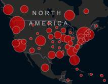

# Novel Coronavirus (COVID-19) Cases

Explore Novel Corona Virus (COVID-19) epidemiological data since 22 January 2020.

> Live map of cases   
>   
> https://data.humdata.org/dataset/novel-coronavirus-2019-ncov-cases 


## Load data

```r
library(tidyverse)
library(lubridate)

data <- read_csv("https://raw.githubusercontent.com/CSSEGISandData/COVID-19/master/csse_covid_19_data/csse_covid_19_time_series/time_series_19-covid-Confirmed.csv")

```

## Results for your state

```r
i_live_in <- "OR"

# Reshape the data
data <- pivot_longer(data, -(`Province/State`:Long), "date", values_to = "confirmed")

# Format date column
data <- rename_at(data, 1:4, ~c("subregion", "region", "lat", "lon")) %>%
        mutate(date = mdy(date))

# Get latest results for chosen subregion
total <- filter(data, str_detect(subregion, i_live_in)) %>%
          group_by(subregion) %>%
          slice(n()) %>%
          ungroup() %>%
          summarise(confirmed = sum(confirmed))

View(total)
```
