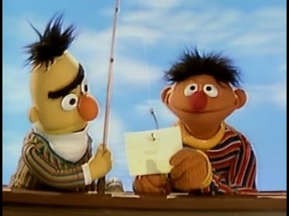

# Exercises


## Partners

### Reading aloud :book: 



They say you should read more to write better.  

Let's practice interpreting R scripts to a partner, who take what you say and turn it back into code. It'll be like a game of **telephone**, but for R.

#### Steps

_Find a partner and decide who gets to be **Bert** and who is **Ernie**._

1. Bert will look at the first code block and tell Ernie what it does.
1. Ernie will then write a code snippet that accomplishes what Bert said.
1. Bert can then offer more clues to help.
    - But try **NOT** to say the exact names of functions, like "`filter`" or "use `select`"

Let's start by turning some fishy code into plain language.

### Bert reads: `big fish` :fish:

<details>

<summary> Bert's :eyes: only!  <i> (No peeking Ernie)</i> </summary>
    
```r

library(readr)

fishes <- read_csv("lake_superior_fish.csv")

names(big_fishes)

nrow(fishes)
 
big_fishes <- filter(fishes, length > 20)

nrow(big_fishes)

```

<details>

**<summary> Example reading  </summary>**

> *Load the package "readr".  
> Then read in the Lake Superior fish data stored in a .csv file and name the data "fishes".   
> View the column names in the fishes data.  
> Count the number of fish.  
> Create a new table called "big_fishes" that contains only the fish with a length longer than 20 inches.  
> Finally, count the number of big fish.*  

</details></details>

<br>

### Ernie reads: `sheep count` :sheep:

<details>

<summary> Ernie's :eyes: only </summary>
    
    
> *Load the package "ggplot2".  
> Create a new variable named "asleep" and set it to false.  
> Create a new variable named "n_sheep" and assign it a value of 3.    
> Create a vector called "names" that contains the 3 text values: "Shrek", "Dolly", & "Beetlejuice". 
> Create a data frame called "my_sheep" with 2 columns: sheep_name that contains the "names" vector above, and "characters" that contains the number of characters in each name.
> Make a gg-scatterplot of my_sheep, with the sheep names along the x-axis and the character length as the y-axis
> Give the plot the title "My sheep names say it all"*


<details> <summary> Example code </summary>
 
```r

library(ggplot2)

asleep <- FALSE

n_sheep <- 3

names <- c("Shrek", "Dolly", "Beetlejuice")

my_sheep <- data.frame(sheep_name = names, characters = nchar(names))

ggplot(my_sheep, aes(x = names, y = characters)) +
     geom_point()
 
``` 

</details>
</details>
