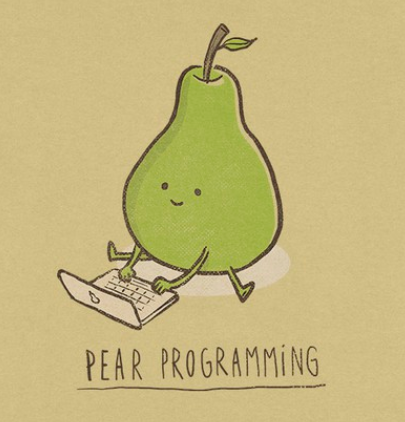

# Pair programming



> "Two pears are better than one."  

Let's practice writing R scripts as a team. One partner will convey what you want to accomplish, while the other writes the R script. There's no pressure, but there might be sugaR :candy: points on the line.

#### Steps

_Use Teams to "call" your partner. The person who can open R the quickest should share their screen. They will be the first script doctor. The other person gets to be the coach / fan / moral support for the first go._

1. The script writer will start reading in the data using the given code.
1. The coach will look at the desired end goal and think about some possible first steps.
1. Then the coach will do their best to convey the goal and steps to their partner as they start building their script.

> **Ta-da!!** After you complete the first one, switch roles and move on to the next challenge.


<br>

> :warning: Don't click below until you have assigned roles. 


### Code challenge #1

<b>Read data</b> <i>(Click here)</i>
  
We'll be working with penguin data.

```r
library(readr)
    
```      

<br>

<details>
<summary> <b>Coach's :eyes: only! </b> <i> (The goal) </i> </summary>
  
<br>
